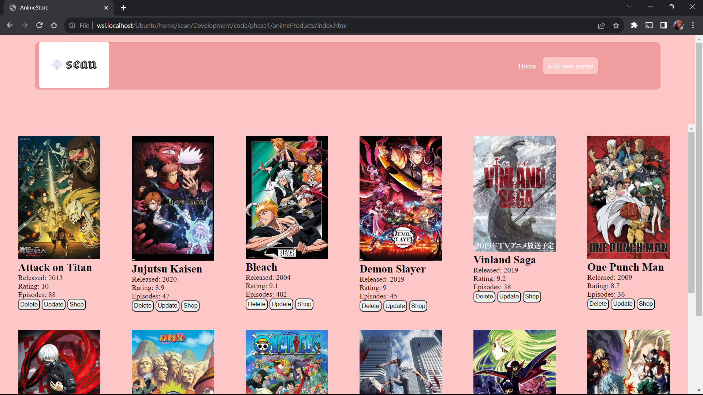

#   ANIME STORE 
#   BY SEAN NYANDUSI 11/10/2023

## Table of Contents

- [Overview](#overview)
- [Features](#features)
- [Usage](#usage)
- [Contributing](#contributing)
- [License](#license)

## Overview
This is a simple web application that allows you to manage and explore anime information, including details about each anime and the merchandise related to it. Users can view, add, update, and delete anime entries, and also explore and purchase merchandise associated with each anime.

## Features
- View a list of anime with details like title, release date, rating, and number of episodes.
- Add new anime entries to the database.
- Update existing anime entries.
- Delete anime entries from the database.
- Explore and shop for merchandise related to each anime.
- Purchase merchandise using a "Buy" button (simulated).
- User-friendly interface with a responsive design.

## Technologies Used
- HTML 5
- CSS
- JavaScript

## Setup
1. Clone this repository to your local machine.
2. Open the `index.html` file in your browser to view the application.

## Usage
- View Anime:
 Launch the application and browse the list of available anime.
 Click on an anime to view more details.
 Explore merchandise related to the selected anime.

- Explore Merchandise:
 Click the "Shop" button on an anime entry to view related merchandise.
 Click the "Buy" button on a merchandise item to simulate a purchase.

- Delete Anime:
  Click the "Delete" button on an anime entry to remove it from the database.

- Update Anime:
  Click the "Update" button on an anime entry.
  Modify the details you want to update.
  Click "Update" to save your changes.

- Add Anime:
 Click the "Add New Anime" link.
 Fill in the details of the new anime, such as title, release date, description, poster URL,  episodes, and rating.
 Click "Add Anime" to add the new entry.

## Known Bugs
- The app work fine.
## Contributing
- Contributions are welcome! If you'd like to contribute to this project, please follow these steps:

- Fork the project.
- Create a new branch for your feature or bug fix: git checkout -b feature/your-feature-name or bugfix/your-bugfix-name.
- Make your changes.
- Commit your changes: git commit -m 'Add new feature'.
- Push your branch: git push origin feature/your-feature-name.
- Submit a pull request.

## Support and contact details
- email :: seanmotanya@gmail.com
- Phone :: +254745071299

### License
*Licenced under the MIT Licence
Copyright (c) 2023 **Sean Nyandusi